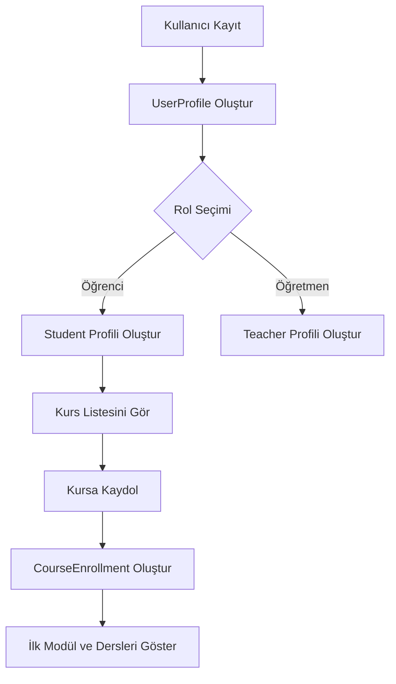
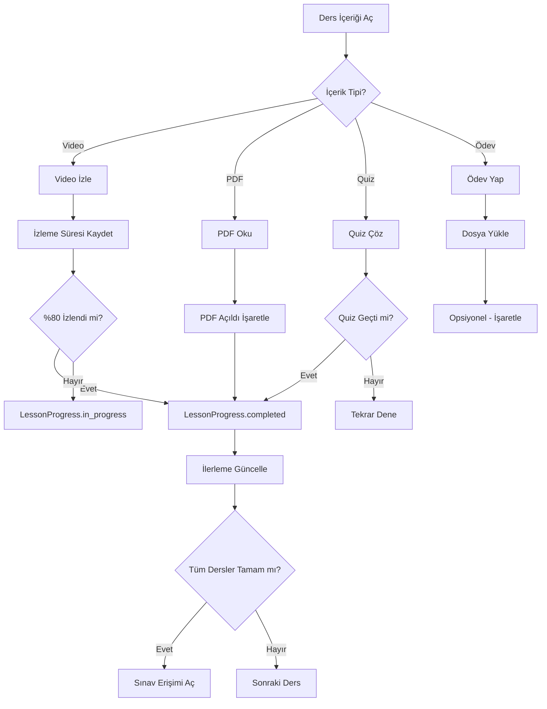
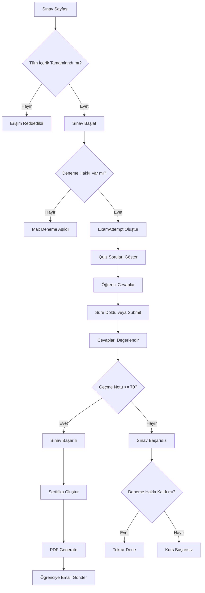

# 🎓 Udemy Benzeri Kurs Platformu - Detaylı Tasarım Belgesi

## 📋 İçindekiler
1. [Mevcut Sistem Analizi](#mevcut-sistem-analizi)
2. [Yeni Platform Özellikleri](#yeni-platform-özellikleri)
3. [Veri Modeli Tasarımı](#veri-modeli-tasarımı)
4. [İş Akışları](#iş-akışları)
5. [Geçiş Stratejisi](#geçiş-stratejisi)
6. [API Endpoint'leri](#api-endpointleri)
7. [Implementasyon Adımları](#implementasyon-adımları)

---

## 1. Mevcut Sistem Analizi

### 🏛️ Mevcut Mimari (Üniversite Tarzı)
```
User (AbstractUser)
  ├── UserProfile (rol: student/teacher/admin)
  ├── Student (school_number, personal_info)
  └── Teacher (tc_no, title, department)

Course (code, name, credits, semester)
  └── CourseGroup (teacher, semester, schedule)
      ├── Enrollment (student, grades: vize/final/büt/proje)
      ├── Assignment (ödev: manual grading required)
      │   └── Submission (öğrenci teslimi)
      ├── Announcement (duyurular)
      ├── CourseContent (hafta bazlı materyaller)
      ├── Quiz (çoktan seçmeli sınavlar)
      └── ExampleQuestion (örnek sorular)
```

### 🎯 Mevcut Sistemin Özellikleri
- ✅ Kullanıcı yönetimi (öğrenci/öğretmen/admin)
- ✅ Ders grubu yönetimi (öğretmen ataması)
- ✅ Ödev sistemi (manuel kontrol gerekli)
- ✅ Not sistemi (vize/final/büt/proje)
- ✅ Quiz sistemi (temel)
- ✅ Ders içeriği (hafta bazlı)
- ✅ Duyuru sistemi
- ✅ JWT ve Session authentication

### ⚠️ Eksik Özellikler (Udemy için)
- ❌ Video içerik yönetimi ve izleme takibi
- ❌ Modül/bölüm bazlı içerik yapısı
- ❌ İlerleme takibi (progress tracking)
- ❌ Kurs tamamlama sistemi
- ❌ Otomatik sertifika üretimi
- ❌ Opsiyonel ödev sistemi
- ❌ Sınav erişim kontrolü (tüm içerik tamamlanmalı)
- ❌ Kurs satın alma/kayıt olma mekanizması

---

## 2. Yeni Platform Özellikleri

### 🎬 Platform Özellikleri Matrisi

| Özellik | Üniversite Sistemi | Udemy Platformu |
|---------|-------------------|-----------------|
| **Ders Yapısı** | Haftalık düzen | Modül → Ders → İçerik |
| **Öğretmen Rolü** | Aktif not verme | İçerik üretici (pasif) |
| **Ödev Sistemi** | Zorunlu, manuel kontrol | Opsiyonel, self-paced |
| **Sınav Erişimi** | Belirli tarihte | Tüm içerik tamamlanınca |
| **Not Sistemi** | Vize/Final/Büt | Sınav geçme/kalma + Sertifika |
| **İlerleme Takibi** | Manuel | Otomatik (video, quiz, vb.) |
| **Sertifika** | Yok | Otomatik (sınav başarılı ise) |
| **Kayıt** | Dönemlik/grup bazlı | Anında, bireysel |

---

## 3. Veri Modeli Tasarımı

### 🗂️ Yeni Modeller

#### 3.1 CourseModule (Kurs Modülleri)
```python
class CourseModule(models.Model):
    """
    Kursun ana bölümleri (Sections)
    Örnek: "1. Giriş", "2. Temel Kavramlar", "3. İleri Seviye"
    """
    course = models.ForeignKey(Course, on_delete=models.CASCADE, related_name='modules')
    title = models.CharField(max_length=200)
    description = models.TextField(blank=True)
    order = models.PositiveIntegerField(default=1)  # Sıralama
    is_active = models.BooleanField(default=True)
    created_at = models.DateTimeField(auto_now_add=True)
    updated_at = models.DateTimeField(auto_now=True)
    
    class Meta:
        ordering = ['order', 'id']
        unique_together = ['course', 'order']
```

#### 3.2 Lesson (Dersler/Videolar)
```python
class Lesson(models.Model):
    """
    Modül içindeki tek bir ders/içerik
    """
    CONTENT_TYPE_CHOICES = [
        ('video', 'Video'),
        ('pdf', 'PDF Döküman'),
        ('quiz', 'Quiz'),
        ('text', 'Metin İçerik'),
        ('assignment', 'Opsiyonel Ödev'),
    ]
    
    module = models.ForeignKey(CourseModule, on_delete=models.CASCADE, related_name='lessons')
    title = models.CharField(max_length=200)
    description = models.TextField(blank=True)
    content_type = models.CharField(max_length=20, choices=CONTENT_TYPE_CHOICES)
    order = models.PositiveIntegerField(default=1)
    
    # Video için
    video_url = models.URLField(blank=True, null=True)  # YouTube, Vimeo, vb.
    video_duration = models.PositiveIntegerField(default=0, help_text='Süre (saniye)')
    
    # PDF için
    pdf_file = models.FileField(upload_to='lessons/pdfs/', blank=True, null=True)
    
    # Metin için
    text_content = models.TextField(blank=True)
    
    # Quiz için (ilişki)
    quiz = models.ForeignKey('Quiz', on_delete=models.SET_NULL, null=True, blank=True, related_name='lessons')
    
    # Opsiyonel ödev için
    is_assignment_optional = models.BooleanField(default=True)
    assignment_description = models.TextField(blank=True)
    
    is_preview = models.BooleanField(default=False)  # Önizleme için açık mı?
    is_mandatory = models.BooleanField(default=True)  # Tamamlanması zorunlu mu?
    created_at = models.DateTimeField(auto_now_add=True)
    updated_at = models.DateTimeField(auto_now=True)
    
    class Meta:
        ordering = ['order', 'id']
        unique_together = ['module', 'order']
```

#### 3.3 LessonProgress (İçerik İlerleme Takibi)
```python
class LessonProgress(models.Model):
    """
    Öğrencinin ders içeriği ilerleme takibi
    """
    STATUS_CHOICES = [
        ('not_started', 'Başlanmadı'),
        ('in_progress', 'Devam Ediyor'),
        ('completed', 'Tamamlandı'),
    ]
    
    student = models.ForeignKey('students.Student', on_delete=models.CASCADE, related_name='lesson_progress')
    lesson = models.ForeignKey(Lesson, on_delete=models.CASCADE, related_name='student_progress')
    enrollment = models.ForeignKey('CourseEnrollment', on_delete=models.CASCADE, related_name='lesson_progress')
    
    status = models.CharField(max_length=20, choices=STATUS_CHOICES, default='not_started')
    
    # Video için
    watched_duration = models.PositiveIntegerField(default=0, help_text='İzlenen süre (saniye)')
    completion_percentage = models.FloatField(default=0.0, validators=[MinValueValidator(0), MaxValueValidator(100)])
    
    # Quiz için
    quiz_score = models.FloatField(null=True, blank=True)
    quiz_passed = models.BooleanField(default=False)
    
    # Opsiyonel ödev için
    assignment_submitted = models.BooleanField(default=False)
    assignment_file = models.FileField(upload_to='optional_assignments/', blank=True, null=True)
    assignment_notes = models.TextField(blank=True)  # Öğrenci notları
    
    started_at = models.DateTimeField(null=True, blank=True)
    completed_at = models.DateTimeField(null=True, blank=True)
    last_accessed = models.DateTimeField(auto_now=True)
    
    class Meta:
        unique_together = ['student', 'lesson', 'enrollment']
        ordering = ['-last_accessed']
```

#### 3.4 CourseEnrollment (Yeni Kayıt Sistemi)
```python
class CourseEnrollment(models.Model):
    """
    Udemy tarzı kurs kaydı - dönem/grup bağımsız
    """
    STATUS_CHOICES = [
        ('active', 'Aktif'),
        ('completed', 'Tamamlandı'),
        ('expired', 'Süresi Dolmuş'),
        ('cancelled', 'İptal Edildi'),
    ]
    
    student = models.ForeignKey('students.Student', on_delete=models.CASCADE, related_name='course_enrollments')
    course = models.ForeignKey(Course, on_delete=models.CASCADE, related_name='course_enrollments')
    
    enrolled_at = models.DateTimeField(auto_now_add=True)
    status = models.CharField(max_length=20, choices=STATUS_CHOICES, default='active')
    
    # İlerleme takibi
    progress_percentage = models.FloatField(default=0.0, validators=[MinValueValidator(0), MaxValueValidator(100)])
    completed_lessons_count = models.PositiveIntegerField(default=0)
    total_lessons_count = models.PositiveIntegerField(default=0)
    
    # Sınav erişimi
    is_eligible_for_exam = models.BooleanField(default=False)  # Tüm içerik tamamlandı mı?
    exam_access_date = models.DateTimeField(null=True, blank=True)  # Sınava erişim tarihi
    
    # Tamamlanma
    completed_at = models.DateTimeField(null=True, blank=True)
    
    # Sertifika
    certificate_issued = models.BooleanField(default=False)
    certificate_issued_at = models.DateTimeField(null=True, blank=True)
    
    last_accessed = models.DateTimeField(auto_now=True)
    
    class Meta:
        unique_together = ['student', 'course']
        ordering = ['-enrolled_at']
```

#### 3.5 CourseExam (Final Sınavı)
```python
class CourseExam(models.Model):
    """
    Kursun final sınavı - tüm içerik tamamlanınca erişilebilir
    """
    course = models.OneToOneField(Course, on_delete=models.CASCADE, related_name='final_exam')
    quiz = models.OneToOneField('Quiz', on_delete=models.CASCADE, related_name='course_exam')
    
    passing_score = models.FloatField(default=70.0, validators=[MinValueValidator(0), MaxValueValidator(100)])
    max_attempts = models.PositiveIntegerField(default=3)
    duration_minutes = models.PositiveIntegerField(default=60)
    
    is_active = models.BooleanField(default=True)
    created_at = models.DateTimeField(auto_now_add=True)
    updated_at = models.DateTimeField(auto_now=True)
```

#### 3.6 ExamAttempt (Sınav Denemesi)
```python
class ExamAttempt(models.Model):
    """
    Öğrencinin sınav denemesi
    """
    STATUS_CHOICES = [
        ('in_progress', 'Devam Ediyor'),
        ('completed', 'Tamamlandı'),
        ('passed', 'Başarılı'),
        ('failed', 'Başarısız'),
    ]
    
    enrollment = models.ForeignKey(CourseEnrollment, on_delete=models.CASCADE, related_name='exam_attempts')
    exam = models.ForeignKey(CourseExam, on_delete=models.CASCADE, related_name='attempts')
    student = models.ForeignKey('students.Student', on_delete=models.CASCADE, related_name='exam_attempts')
    
    attempt_number = models.PositiveIntegerField(default=1)
    score = models.FloatField(null=True, blank=True)
    status = models.CharField(max_length=20, choices=STATUS_CHOICES, default='in_progress')
    
    started_at = models.DateTimeField(auto_now_add=True)
    completed_at = models.DateTimeField(null=True, blank=True)
    
    # Sınav detayları (Quiz sistemini kullan)
    quiz_attempt = models.OneToOneField('QuizAttempt', on_delete=models.CASCADE, related_name='exam_attempt')
    
    class Meta:
        ordering = ['-started_at']
        unique_together = ['enrollment', 'attempt_number']
```

#### 3.7 Certificate (Sertifika)
```python
class Certificate(models.Model):
    """
    Otomatik oluşturulan sertifikalar
    """
    enrollment = models.OneToOneField(CourseEnrollment, on_delete=models.CASCADE, related_name='certificate')
    student = models.ForeignKey('students.Student', on_delete=models.CASCADE, related_name='certificates')
    course = models.ForeignKey(Course, on_delete=models.CASCADE, related_name='certificates')
    
    certificate_id = models.CharField(max_length=100, unique=True)  # Benzersiz ID
    issue_date = models.DateTimeField(auto_now_add=True)
    
    # Sınav bilgileri
    exam_score = models.FloatField()
    completion_date = models.DateTimeField()
    
    # PDF
    certificate_file = models.FileField(upload_to='certificates/', blank=True, null=True)
    
    # Doğrulama
    verification_url = models.URLField(blank=True)
    is_valid = models.BooleanField(default=True)
    
    created_at = models.DateTimeField(auto_now_add=True)
    
    class Meta:
        ordering = ['-issue_date']
```

#### 3.8 OptionalAssignment (Opsiyonel Ödev)
```python
class OptionalAssignment(models.Model):
    """
    Opsiyonel ödevler - not verilmez, sadece öğrenci takibi için
    """
    STATUS_CHOICES = [
        ('pending', 'Beklemede'),
        ('submitted', 'Teslim Edildi'),
        ('feedback_given', 'Geri Bildirim Verildi'),
    ]
    
    lesson = models.OneToOneField(Lesson, on_delete=models.CASCADE, related_name='optional_assignment')
    title = models.CharField(max_length=200)
    description = models.TextField()
    
    # Referans materyaller
    reference_file = models.FileField(upload_to='optional_assignments/references/', blank=True, null=True)
    
    created_at = models.DateTimeField(auto_now_add=True)
    updated_at = models.DateTimeField(auto_now=True)
```

---

## 4. İş Akışları

### 🔄 4.1 Kullanıcı Kaydı ve Kursa Katılma



**Implementasyon:**
```python
# views.py
class CourseEnrollView(APIView):
    permission_classes = [IsAuthenticated]
    
    def post(self, request, course_id):
        student = request.user.student
        course = get_object_or_404(Course, id=course_id, status='active')
        
        # Zaten kayıtlı mı kontrol et
        if CourseEnrollment.objects.filter(student=student, course=course).exists():
            return Response({'error': 'Zaten bu kursa kayıtlısınız'}, status=400)
        
        # Kayıt oluştur
        enrollment = CourseEnrollment.objects.create(
            student=student,
            course=course,
            total_lessons_count=course.modules.aggregate(
                total=Count('lessons', filter=Q(lessons__is_mandatory=True))
            )['total']
        )
        
        # İlk modülü ve dersleri getir
        first_module = course.modules.first()
        
        return Response({
            'enrollment_id': enrollment.id,
            'course': CourseSerializer(course).data,
            'first_module': ModuleSerializer(first_module).data,
            'progress': 0
        })
```

### 📚 4.2 İçerik Tamamlama İş Akışı



**Implementasyon:**
```python
# services.py
class LessonProgressService:
    @staticmethod
    def update_video_progress(student, lesson, watched_duration):
        """Video izleme ilerlemesini güncelle"""
        progress, created = LessonProgress.objects.get_or_create(
            student=student,
            lesson=lesson,
            enrollment=CourseEnrollment.objects.get(student=student, course=lesson.module.course)
        )
        
        progress.watched_duration = watched_duration
        progress.completion_percentage = (watched_duration / lesson.video_duration) * 100
        
        # %80 izlenmişse tamamlandı say
        if progress.completion_percentage >= 80:
            progress.status = 'completed'
            progress.completed_at = timezone.now()
        else:
            progress.status = 'in_progress'
        
        if not progress.started_at:
            progress.started_at = timezone.now()
        
        progress.save()
        
        # Kurs ilerlemesini güncelle
        LessonProgressService.update_course_progress(student, lesson.module.course)
        
        return progress
    
    @staticmethod
    def update_course_progress(student, course):
        """Kurs genel ilerlemesini güncelle"""
        enrollment = CourseEnrollment.objects.get(student=student, course=course)
        
        # Tamamlanan zorunlu dersleri say
        completed_count = LessonProgress.objects.filter(
            student=student,
            lesson__module__course=course,
            lesson__is_mandatory=True,
            status='completed'
        ).count()
        
        enrollment.completed_lessons_count = completed_count
        enrollment.progress_percentage = (completed_count / enrollment.total_lessons_count) * 100
        
        # Tüm dersler tamamlandıysa sınav erişimi aç
        if enrollment.progress_percentage >= 100:
            enrollment.is_eligible_for_exam = True
            enrollment.exam_access_date = timezone.now()
        
        enrollment.save()
        return enrollment
    
    @staticmethod
    def mark_pdf_completed(student, lesson):
        """PDF okundu olarak işaretle"""
        progress, created = LessonProgress.objects.get_or_create(
            student=student,
            lesson=lesson,
            enrollment=CourseEnrollment.objects.get(student=student, course=lesson.module.course)
        )
        
        progress.status = 'completed'
        progress.completion_percentage = 100
        progress.completed_at = timezone.now()
        
        if not progress.started_at:
            progress.started_at = timezone.now()
        
        progress.save()
        
        LessonProgressService.update_course_progress(student, lesson.module.course)
        return progress
    
    @staticmethod
    def submit_optional_assignment(student, lesson, file, notes=''):
        """Opsiyonel ödev gönder"""
        progress, created = LessonProgress.objects.get_or_create(
            student=student,
            lesson=lesson,
            enrollment=CourseEnrollment.objects.get(student=student, course=lesson.module.course)
        )
        
        progress.assignment_submitted = True
        progress.assignment_file = file
        progress.assignment_notes = notes
        progress.status = 'completed'
        progress.completion_percentage = 100
        progress.completed_at = timezone.now()
        
        if not progress.started_at:
            progress.started_at = timezone.now()
        
        progress.save()
        
        # Not: Opsiyonel ödevler kurs ilerlemesini etkilemez (is_mandatory=False olabilir)
        return progress
```

### 🎓 4.3 Sınav Erişimi ve Tamamlama



**Implementasyon:**
```python
# services.py
class ExamService:
    @staticmethod
    def can_take_exam(student, course):
        """Öğrenci sınava girebilir mi?"""
        try:
            enrollment = CourseEnrollment.objects.get(student=student, course=course)
            return enrollment.is_eligible_for_exam
        except CourseEnrollment.DoesNotExist:
            return False
    
    @staticmethod
    def start_exam(student, course):
        """Sınavı başlat"""
        enrollment = CourseEnrollment.objects.get(student=student, course=course)
        exam = course.final_exam
        
        # Deneme sayısını kontrol et
        attempts_count = ExamAttempt.objects.filter(
            enrollment=enrollment,
            exam=exam
        ).count()
        
        if attempts_count >= exam.max_attempts:
            raise ValidationError('Maksimum deneme sayısına ulaştınız')
        
        # QuizAttempt oluştur
        quiz_attempt = QuizAttempt.objects.create(
            quiz=exam.quiz,
            student=student
        )
        
        # ExamAttempt oluştur
        exam_attempt = ExamAttempt.objects.create(
            enrollment=enrollment,
            exam=exam,
            student=student,
            attempt_number=attempts_count + 1,
            quiz_attempt=quiz_attempt
        )
        
        return exam_attempt
    
    @staticmethod
    def complete_exam(exam_attempt):
        """Sınavı tamamla ve değerlendir"""
        quiz_attempt = exam_attempt.quiz_attempt
        quiz_attempt.is_submitted = True
        quiz_attempt.completed_at = timezone.now()
        
        # Cevapları değerlendir
        total_questions = quiz_attempt.quiz.questions.count()
        correct_answers = QuizAnswer.objects.filter(
            attempt=quiz_attempt,
            is_correct=True
        ).count()
        
        score = (correct_answers / total_questions) * 100
        quiz_attempt.score = score
        quiz_attempt.save()
        
        exam_attempt.score = score
        exam_attempt.completed_at = timezone.now()
        
        # Geçti mi?
        if score >= exam_attempt.exam.passing_score:
            exam_attempt.status = 'passed'
            
            # Enrollment'ı tamamla
            enrollment = exam_attempt.enrollment
            enrollment.status = 'completed'
            enrollment.completed_at = timezone.now()
            enrollment.save()
            
            # Sertifika oluştur
            CertificateService.generate_certificate(exam_attempt)
        else:
            exam_attempt.status = 'failed'
        
        exam_attempt.save()
        return exam_attempt

class CertificateService:
    @staticmethod
    def generate_certificate(exam_attempt):
        """Otomatik sertifika oluştur"""
        from reportlab.pdfgen import canvas
        from reportlab.lib.pagesizes import A4, landscape
        from reportlab.lib.units import cm
        import uuid
        
        enrollment = exam_attempt.enrollment
        student = enrollment.student
        course = enrollment.course
        
        # Benzersiz ID
        cert_id = f"CERT-{course.code}-{student.school_number}-{uuid.uuid4().hex[:8].upper()}"
        
        # Certificate kaydı oluştur
        certificate = Certificate.objects.create(
            enrollment=enrollment,
            student=student,
            course=course,
            certificate_id=cert_id,
            exam_score=exam_attempt.score,
            completion_date=exam_attempt.completed_at,
            verification_url=f"https://platform.edu/verify/{cert_id}"
        )
        
        # PDF oluştur
        pdf_path = f'certificates/{cert_id}.pdf'
        full_path = os.path.join(settings.MEDIA_ROOT, pdf_path)
        os.makedirs(os.path.dirname(full_path), exist_ok=True)
        
        # Canvas oluştur (landscape A4)
        c = canvas.Canvas(full_path, pagesize=landscape(A4))
        width, height = landscape(A4)
        
        # Sertifika tasarımı
        c.setFont("Helvetica-Bold", 40)
        c.drawCentredString(width/2, height - 5*cm, "SERTİFİKA")
        
        c.setFont("Helvetica", 16)
        c.drawCentredString(width/2, height - 8*cm, "Bu belge ile")
        
        c.setFont("Helvetica-Bold", 28)
        c.drawCentredString(width/2, height - 10*cm, student.full_name)
        
        c.setFont("Helvetica", 16)
        c.drawCentredString(width/2, height - 12*cm, f"{course.name} ({course.code})")
        c.drawCentredString(width/2, height - 13.5*cm, "kursunu başarıyla tamamladığını onaylar.")
        
        c.setFont("Helvetica", 12)
        c.drawCentredString(width/2, height - 15.5*cm, f"Sınav Puanı: {exam_attempt.score:.1f}")
        c.drawCentredString(width/2, height - 16.5*cm, f"Tamamlanma Tarihi: {enrollment.completed_at.strftime('%d.%m.%Y')}")
        c.drawCentredString(width/2, height - 17.5*cm, f"Sertifika No: {cert_id}")
        c.drawCentredString(width/2, height - 18.5*cm, f"Doğrulama: {certificate.verification_url}")
        
        c.save()
        
        # Certificate'e PDF dosyasını ekle
        certificate.certificate_file = pdf_path
        certificate.save()
        
        # Enrollment'ı güncelle
        enrollment.certificate_issued = True
        enrollment.certificate_issued_at = timezone.now()
        enrollment.save()
        
        # Email gönder (opsiyonel)
        # EmailService.send_certificate_email(student, certificate)
        
        return certificate
```

### 📊 4.4 İlerleme Takibi Dashboard

```python
# views.py
class StudentDashboardView(APIView):
    permission_classes = [IsAuthenticated]
    
    def get(self, request):
        student = request.user.student
        
        # Aktif kurslar
        enrollments = CourseEnrollment.objects.filter(
            student=student,
            status='active'
        ).select_related('course').prefetch_related(
            'lesson_progress',
            'exam_attempts'
        )
        
        dashboard_data = []
        for enrollment in enrollments:
            course = enrollment.course
            
            # Son erişilen ders
            last_lesson = enrollment.lesson_progress.filter(
                status__in=['in_progress', 'completed']
            ).order_by('-last_accessed').first()
            
            # Sonraki ders
            next_lesson = None
            if last_lesson:
                # Aynı modülde sonraki ders
                next_lesson = Lesson.objects.filter(
                    module=last_lesson.lesson.module,
                    order__gt=last_lesson.lesson.order
                ).first()
                
                if not next_lesson:
                    # Sonraki modülün ilk dersi
                    next_module = CourseModule.objects.filter(
                        course=course,
                        order__gt=last_lesson.lesson.module.order
                    ).first()
                    if next_module:
                        next_lesson = next_module.lessons.first()
            else:
                # Hiç ders başlanmamışsa ilk modülün ilk dersi
                first_module = course.modules.first()
                if first_module:
                    next_lesson = first_module.lessons.first()
            
            dashboard_data.append({
                'course': {
                    'id': course.id,
                    'name': course.name,
                    'code': course.code,
                    'description': course.description,
                },
                'progress': {
                    'percentage': enrollment.progress_percentage,
                    'completed_lessons': enrollment.completed_lessons_count,
                    'total_lessons': enrollment.total_lessons_count,
                },
                'last_lesson': LessonSerializer(last_lesson.lesson).data if last_lesson else None,
                'next_lesson': LessonSerializer(next_lesson).data if next_lesson else None,
                'exam_eligible': enrollment.is_eligible_for_exam,
                'exam_attempts': enrollment.exam_attempts.count(),
                'certificate_issued': enrollment.certificate_issued,
            })
        
        # Tamamlanan kurslar
        completed_enrollments = CourseEnrollment.objects.filter(
            student=student,
            status='completed',
            certificate_issued=True
        ).select_related('course', 'certificate')
        
        certificates = [
            {
                'course': enrollment.course.name,
                'certificate_id': enrollment.certificate.certificate_id,
                'issue_date': enrollment.certificate.issue_date,
                'score': enrollment.certificate.exam_score,
                'certificate_url': enrollment.certificate.certificate_file.url if enrollment.certificate.certificate_file else None,
            }
            for enrollment in completed_enrollments
        ]
        
        return Response({
            'active_courses': dashboard_data,
            'certificates': certificates,
            'total_courses': enrollments.count(),
            'completed_courses': completed_enrollments.count(),
        })
```

---

## 5. Geçiş Stratejisi

### 🔄 Mevcut Sistemi Koruma

Mevcut üniversite sisteminizi **koruyarak** yeni Udemy platformunu eklemeniz önerilir:

```python
# courses/models.py - Güncellenmiş Course modeli
class Course(models.Model):
    # ... mevcut alanlar ...
    
    # Yeni alanlar
    COURSE_TYPE_CHOICES = [
        ('university', 'Üniversite Dersi'),  # Eski sistem
        ('online', 'Online Kurs'),            # Yeni Udemy tarzı
    ]
    course_type = models.CharField(
        max_length=20, 
        choices=COURSE_TYPE_CHOICES, 
        default='university'
    )
    
    # Online kurslar için
    is_self_paced = models.BooleanField(default=False)  # Kendi hızında mı?
    estimated_duration_hours = models.PositiveIntegerField(default=0)
    level = models.CharField(max_length=20, blank=True)  # Beginner, Intermediate, Advanced
```

### 📋 Geçiş Adımları

1. **Faz 1: Model Ekleme** (1-2 hafta)
   - Yeni modelleri ekle (CourseModule, Lesson, LessonProgress, vb.)
   - Migrasyonları çalıştır
   - Admin paneline kaydet

2. **Faz 2: Service Layer** (1 hafta)
   - İlerleme takibi servisleri
   - Sertifika üretim servisi
   - Email servisleri

3. **Faz 3: API Endpoints** (1-2 hafta)
   - Kurs kayıt API'si
   - İçerik izleme API'si
   - Sınav API'si
   - Sertifika API'si

4. **Faz 4: Frontend** (2-3 hafta)
   - Kurs listesi ve detay sayfası
   - Video oynatıcı entegrasyonu
   - İlerleme takibi dashboard
   - Sınav arayüzü

5. **Faz 5: Test ve Deployment** (1 hafta)
   - Unit testler
   - Integration testler
   - Production deployment

---

## 6. API Endpoint'leri

### 📡 Kurs Yönetimi

```python
# urls.py
urlpatterns = [
    # Kurs Listesi ve Kayıt
    path('api/courses/', CourseListView.as_view()),
    path('api/courses/<int:id>/', CourseDetailView.as_view()),
    path('api/courses/<int:id>/enroll/', CourseEnrollView.as_view()),
    
    # İçerik Erişimi
    path('api/courses/<int:course_id>/modules/', ModuleListView.as_view()),
    path('api/modules/<int:module_id>/lessons/', LessonListView.as_view()),
    path('api/lessons/<int:id>/', LessonDetailView.as_view()),
    
    # İlerleme Takibi
    path('api/lessons/<int:id>/progress/', UpdateLessonProgressView.as_view()),
    path('api/enrollments/<int:id>/progress/', EnrollmentProgressView.as_view()),
    
    # Sınav
    path('api/courses/<int:course_id>/exam/', ExamDetailView.as_view()),
    path('api/exams/<int:id>/start/', StartExamView.as_view()),
    path('api/exam-attempts/<int:id>/submit/', SubmitExamView.as_view()),
    
    # Sertifika
    path('api/certificates/', MyCertificatesView.as_view()),
    path('api/certificates/<str:cert_id>/', CertificateDetailView.as_view()),
    path('api/certificates/<str:cert_id>/verify/', VerifyCertificateView.as_view()),
    
    # Dashboard
    path('api/dashboard/', StudentDashboardView.as_view()),
]
```

### 📝 Örnek Request/Response

#### Kursa Kayıt Olma
```http
POST /api/courses/123/enroll/
Authorization: Bearer <token>

Response:
{
  "enrollment_id": 456,
  "course": {
    "id": 123,
    "name": "Python ile Web Geliştirme",
    "code": "PYTH301",
    "estimated_duration": 40
  },
  "progress": 0,
  "first_module": {
    "id": 1,
    "title": "Giriş",
    "lessons": [...]
  }
}
```

#### Video İlerleme Güncelleme
```http
POST /api/lessons/789/progress/
Authorization: Bearer <token>
Content-Type: application/json

{
  "content_type": "video",
  "watched_duration": 450
}

Response:
{
  "lesson_id": 789,
  "status": "in_progress",
  "completion_percentage": 75.0,
  "course_progress": 35.5,
  "next_lesson": {...}
}
```

---

## 7. Implementasyon Adımları

### ✅ Checklist

#### Adım 1: Database Migrasyonları
```bash
# Yeni modelleri ekledikten sonra
python manage.py makemigrations courses
python manage.py migrate
```

#### Adım 2: Admin Paneli Kayıtları
```python
# courses/admin.py
@admin.register(CourseModule)
class CourseModuleAdmin(admin.ModelAdmin):
    list_display = ['course', 'title', 'order', 'is_active']
    list_filter = ['course', 'is_active']
    ordering = ['course', 'order']

@admin.register(Lesson)
class LessonAdmin(admin.ModelAdmin):
    list_display = ['module', 'title', 'content_type', 'order', 'is_mandatory']
    list_filter = ['content_type', 'is_mandatory', 'module__course']
    ordering = ['module', 'order']

@admin.register(CourseEnrollment)
class CourseEnrollmentAdmin(admin.ModelAdmin):
    list_display = ['student', 'course', 'progress_percentage', 'status', 'enrolled_at']
    list_filter = ['status', 'course']
    readonly_fields = ['enrolled_at', 'completed_at', 'certificate_issued_at']

@admin.register(Certificate)
class CertificateAdmin(admin.ModelAdmin):
    list_display = ['certificate_id', 'student', 'course', 'exam_score', 'issue_date']
    readonly_fields = ['certificate_id', 'issue_date']
    search_fields = ['certificate_id', 'student__first_name', 'student__last_name']
```

#### Adım 3: Serializers
```python
# courses/serializers.py
class CourseModuleSerializer(serializers.ModelSerializer):
    lessons_count = serializers.IntegerField(read_only=True)
    duration = serializers.SerializerMethodField()
    
    class Meta:
        model = CourseModule
        fields = ['id', 'title', 'description', 'order', 'lessons_count', 'duration']
    
    def get_duration(self, obj):
        total_seconds = obj.lessons.aggregate(
            total=Sum('video_duration')
        )['total'] or 0
        return total_seconds // 60  # dakika cinsinden

class LessonSerializer(serializers.ModelSerializer):
    module_title = serializers.CharField(source='module.title', read_only=True)
    progress = serializers.SerializerMethodField()
    
    class Meta:
        model = Lesson
        fields = ['id', 'module_title', 'title', 'description', 'content_type', 
                  'order', 'video_url', 'video_duration', 'is_preview', 
                  'is_mandatory', 'progress']
    
    def get_progress(self, obj):
        request = self.context.get('request')
        if request and request.user.is_authenticated:
            try:
                progress = LessonProgress.objects.get(
                    student=request.user.student,
                    lesson=obj
                )
                return {
                    'status': progress.status,
                    'completion': progress.completion_percentage,
                    'last_accessed': progress.last_accessed
                }
            except LessonProgress.DoesNotExist:
                return None
        return None

class CourseEnrollmentSerializer(serializers.ModelSerializer):
    course = CourseSerializer(read_only=True)
    current_module = serializers.SerializerMethodField()
    
    class Meta:
        model = CourseEnrollment
        fields = ['id', 'course', 'progress_percentage', 'completed_lessons_count',
                  'total_lessons_count', 'is_eligible_for_exam', 'status', 
                  'enrolled_at', 'current_module']
    
    def get_current_module(self, obj):
        # Son erişilen dersin modülünü döndür
        last_progress = obj.lesson_progress.order_by('-last_accessed').first()
        if last_progress:
            return CourseModuleSerializer(last_progress.lesson.module).data
        return None
```

#### Adım 4: Management Commands
```python
# courses/management/commands/setup_sample_course.py
from django.core.management.base import BaseCommand
from apps.courses.models import Course, CourseModule, Lesson

class Command(BaseCommand):
    help = 'Örnek online kurs oluştur'
    
    def handle(self, *args, **options):
        # Kurs oluştur
        course = Course.objects.create(
            code='PY101',
            name='Python Temelleri',
            credits=3,
            description='Sıfırdan Python öğrenin',
            department='Bilgisayar Bilimleri',
            semester='fall',
            capacity=1000,
            course_type='online',
            is_self_paced=True,
            estimated_duration_hours=20,
            level='Beginner',
            status='active'
        )
        
        # Modül 1
        module1 = CourseModule.objects.create(
            course=course,
            title='1. Python\'a Giriş',
            description='Python dilinin temelleri',
            order=1
        )
        
        Lesson.objects.create(
            module=module1,
            title='Python Nedir?',
            content_type='video',
            video_url='https://youtube.com/...',
            video_duration=600,  # 10 dakika
            order=1
        )
        
        Lesson.objects.create(
            module=module1,
            title='Python Kurulumu',
            content_type='video',
            video_url='https://youtube.com/...',
            video_duration=900,  # 15 dakika
            order=2
        )
        
        # Quiz
        from apps.courses.models import Quiz
        quiz = Quiz.objects.create(
            course=course,
            title='Giriş Quiz',
            quiz_type='quiz',
            duration_minutes=10
        )
        
        Lesson.objects.create(
            module=module1,
            title='Giriş Quiz',
            content_type='quiz',
            quiz=quiz,
            order=3
        )
        
        self.stdout.write(self.style.SUCCESS(f'Kurs oluşturuldu: {course.name}'))
```

---

## 🎯 Özet ve Öneriler

### Temel Değişiklikler
1. **Kurs Yapısı**: Haftalık → Modül/Ders bazlı
2. **Kayıt**: Grup/Dönem bazlı → Bireysel, anında
3. **Ödevler**: Zorunlu/Manuel → Opsiyonel/Self-paced
4. **Sınavlar**: Belirli tarih → İçerik tamamlandıktan sonra
5. **Sertifika**: Yok → Otomatik üretim
6. **İlerleme**: Manuel → Otomatik takip

### Mevcut Sistemi Koruma
- `course_type` field ile eski ve yeni sistemi ayırın
- Mevcut CourseGroup ve Enrollment modellerini koruyun
- Yeni CourseEnrollment ile paralel çalıştırın

### Önemli Noktalar
- ✅ Video izleme tracking için frontend JavaScript gerekli
- ✅ PDF generate için ReportLab zaten kurulu
- ✅ Email gönderimi için SMTP ayarları yapılmalı
- ✅ Video hosting için YouTube/Vimeo veya S3 kullanın
- ✅ Sertifika doğrulama için public endpoint ekleyin

### Performans İyileştirmeleri
- Caching: Redis ile ilerleme verilerini cache'leyin
- Database indexing: Foreign key ve sık sorgulanan alanlara index
- Lazy loading: Video URL'leri sadece gerektiğinde yükleyin
- Background tasks: Sertifika üretimi için Celery kullanın

---

## 📞 Destek ve Dokümantasyon

Bu tasarım belgesi projenizin **genel mimarisine uygun** olarak hazırlanmıştır:
- ✅ MVC pattern (Django MTV)
- ✅ Service layer (business logic ayrı)
- ✅ REST API (DRF ile)
- ✅ JWT + Session authentication
- ✅ Admin panel entegrasyonu

Herhangi bir bölümün detaylı implementasyonunu isterseniz, ilgili kod dosyalarını oluşturabilirim.
